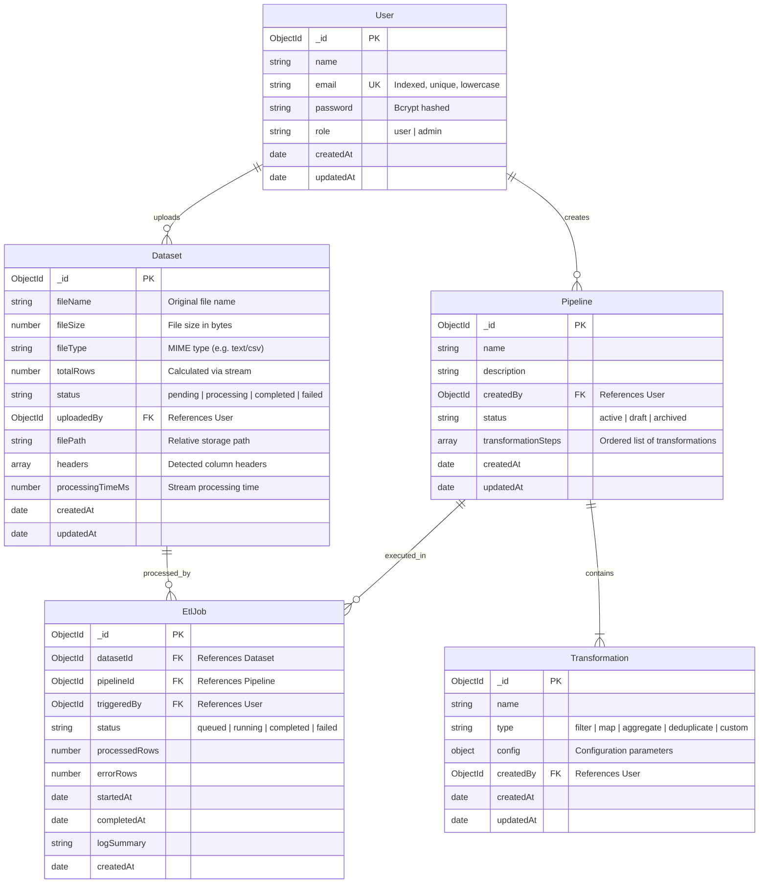

# StreamWeaver Database Architecture

## Overview
StreamWeaver is a streaming ETL pipeline platform capable of handling large-scale datasets using native Node.js streams and MongoDB.

The Week 1 database architecture establishes the following 5 initial collections:
1. **`users`**: User identity, authentication, and access control.
2. **`datasets`**: File metadata, storage details, row metrics, and upload states.
3. **`pipelines`**: Configuration and sequence of transformations for data workflows.
4. **`etl_jobs`**: Execution instances of pipelines running on datasets.
5. **`transformations`**: Reusable data transformation definitions (filter, map, aggregate, clean).

---

## Entity Relationship (ER) Diagram

---

## Collections Specification

### 1. `users` Collection
- **Indexes**:
  - `{ email: 1 }` (Unique)
- **Validation**:
  - Email format regex validation
  - Minimum password length: 6 characters (hashed via bcrypt before saving)

### 2. `datasets` Collection
- **Indexes**:
  - `{ uploadedBy: 1, createdAt: -1 }` (Quick user dataset listing)
  - `{ status: 1 }` (Querying pending/processing jobs)
- **Validation & Defaults**:
  - `status`: Default `'pending'`, enum: `['pending', 'processing', 'completed', 'failed']`
  - `totalRows`: Default `0`

### 3. `pipelines` Collection
- Stores workflow configurations linking multiple transformation steps.

### 4. `etl_jobs` Collection
- Tracks real-time job execution state, row throughput, error rates, and timing.

### 5. `transformations` Collection
- Modular, pluggable transformations reusable across pipelines.
